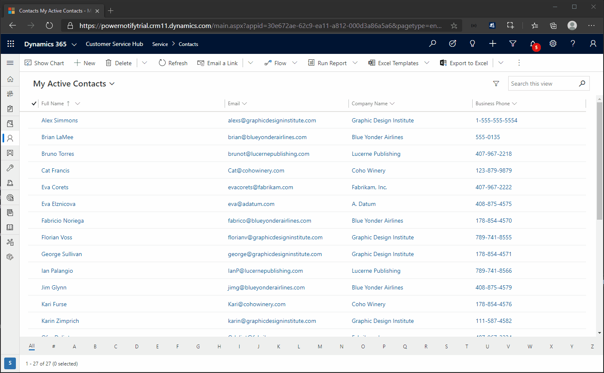
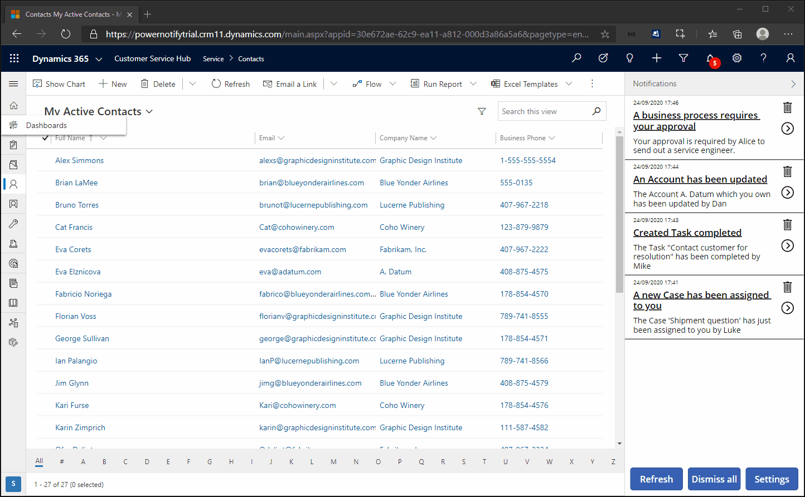
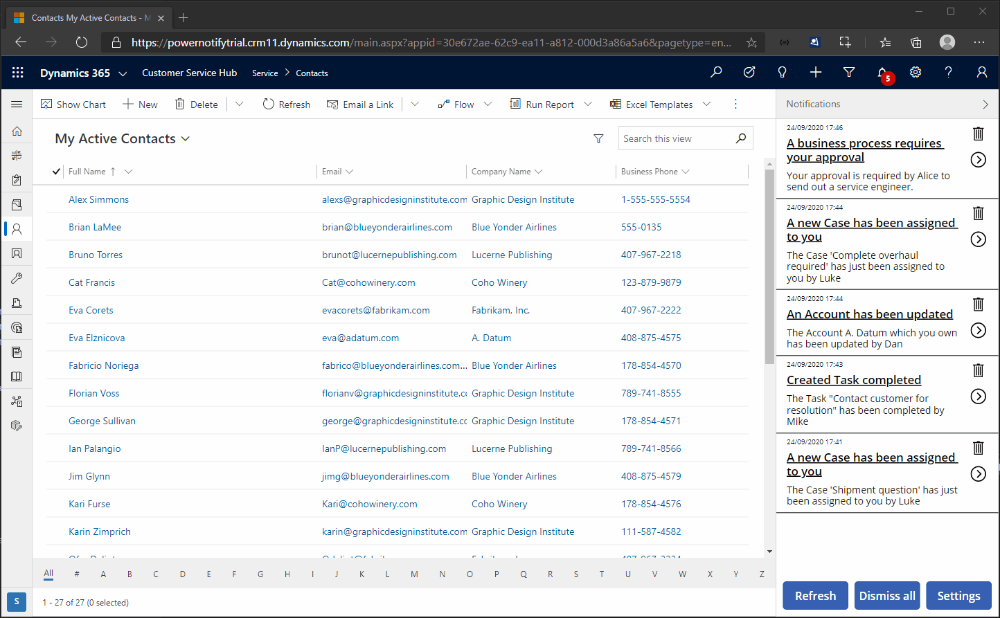

# PowerNotify for an end user

PowerNotify delivers real time notifications to you when events occur that you choose to be notified about. As we move away from a business world that evolves around emails, for those who work directly in a CRM system, you should be able to receive notifications within the app, similar to the notification centre on your phone.

What are some use cases?
- Case status has changed
- Important information has changed on a Contact record
- New sale opportunity arrises
- The list is endless!

## Methods of delivery
In PowerNotify there are four methods of receiving notifications:
- Web
- Mobile
- Email
- Notification Tray

To receive notifications via Mobile, please see the steps [here](#how-do-i-setup-powernotify-on-mobile) to register your device for mobile notifications.

## What is the Notification Tray?
The Notification Tray is a core part of Power Notify. From here you can setup you event subscriptions and manage all of your notifications.

- It's always accessible through the fixed location in the top right hand corner.

- To open, you simply click the icon. The number represents the number of notifications currently in the notification tray.

- The first time you access the Notification Tray, you will be prompted with the below dialog box, asking you if you would like to receive notifications via this browser. If you would like this option select 'Yes' otherwise select 'No'.

### How to manage my devices?
**Starting from the home page of the Notification Tray**
1. Click **Settings**
2. Click **Manage Device Subscriptions**

Here you will see all devices to which you are subscribed to receive notifications

You can rename any device by 
1. Simply clicking anywhere on the name of the Device Subscription Record
2. Entering the new name
3. Clicking anywhere on the screen away from the name

You can collapse the Notification Tray at any point by clicking '>' in the top right-hand corner.

To re-open the Notification Tray for viewing when collapsed, click '<'. 

## Notifications
Notifications are the main feature of PowerNotify. They inform you of key events which have occured in the system in real time. To receive notifications you first must subscribe to an event. 

### How to subscribe & unsubscribe from events?
**Prior to being able to subscribe to any events, events must be created first. For more information on how to create events, please visit this [page](./How-to-integrate.md).**
1. Open the Notification Tray
2. Click **Settings**
3. Click **Manage Event Subscriptions**
4. Click **Add Subscription**
5. Select an event to subscribe to from the events listed by clicking on the name of the event
6. Choose your methods to be notified by, selecting as many or few as you like by clicking on the name of the methods
7. Click **Save Subscription**
8. On the **Notification Subscriptions** screen you'll then see the event to which you're now subscribed

### Amend notification methods for an event
**Starting from the home page of the Notification Tray**

1. Click **Settings**
2. Click **Manage Event Subscriptions**
3. Click on the drop-down associated with the particular event you wish to amend your notification methods
4. To add new ones select the additional method
5. To remove click the **x** for the mechanism you no longer want to be notified by

### Unsubscribing to an event
**Starting from the home page of the Notification Tray**

1. Click **Settings**
2. Click **Manage Event Subscriptions**
3. Click the **bin** icon associated with the particular event you wish to delete
4. You are now no longer subscribed to an event and won't receive any notifications when that event is triggered. The event is also remove from the Notification Subscription screen.

Once you are subscribed to an event, when that event is triggered, you'll receive a notification in the notification tray.

### What can you do with a notification?
1. Open a record from a notification
2. Dismiss notifications

### Open a record from a notification
When you have notifications in your notification tray, you can click on the circular icon with '>' to open the specific record for which you've received a notification.

### How do I clear down my notification tray?
There are **two** methods to clear out notifications listed in the Notification Tray. 
1. Individual
2. All

#### **Individual**
Removing one by one gives you the complete control regarding what notifications to keep or delete. To remove click on the 'bin' icon next to the notification you wish to remove. 

#### **All**
Sometimes you just want to remove all notifications in one go because you've seen them all and they're no longer relevant.

1. On the bottom of the homepage within the Notification Tray, simply click **Dismiss All**. *Poof*, just like magic, they're all gone!

## Additional Instructions
If you no longer want a particular device to receive notifications, because maybe you don't own that device any longer, you can simply click the 'bin' icon associated with that Device Subscription record. After a few seconds you'll no longer see that device listed.

### Re-setup a browser for PowerNotify
Once you've deleted your device, after some days/weeks/months, you may want to set the device up again. Browsers hold onto a setting preventing PowerNotify recognising your device as a new device.

1. Click the padlock adjacent to the URL
2. Set **Notifications** to **Ask (Default)**
3. Click **X** in the top right hand corner of the pop-up window.
4. Refresh browser
5. Open the Notification Tray and you will be prompted to enable this browser to receive notifications.

## How do I setup PowerNotify on mobile?
1. Download the Power Apps mobile app from your phones app store
 

2. Launch the app
3. Click '**Sign in**'
   
  
4. Enter your username and password
   
  
5. Open the Notification Tray App
   
  
